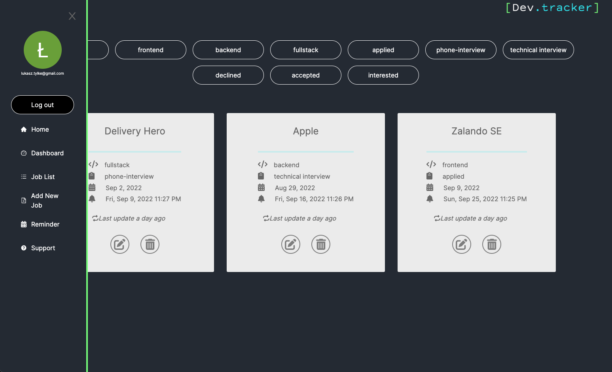

# DevTracker

<p align="center" style="background-color: black">
  
</p>
DevTracker is a companion app for software engineers who are active one the job market. It supports them by managing job applications, reminding them about upcoming interviews, and archiving recruitment information. 
## Screenshots

<p align="center">
  
</p>

## Getting Started

1. Clone this repo.

    ```bash
    git clone https://github.com/lthemis/DevTracker.git
    ```

2. Install Docker

    ```bash
    https://docs.docker.com/get-docker/
    ```
3. Create Firebase account, add a new project, click "Web" icon, register app under any name and copy contents of firebaseConfig. Click 'Continue to the console'. Click "Authentication", then "Sign-in method" and enable Google as provider. Finally, go to Settings, then click "Authorised domains" and add "localhost" if it's not there by default. 

    ```bash
    https://console.firebase.google.com/
    ```


4. Create .env file in client folder and paste previously copied contents of firebaseConfig

    ```bash
    REACT_APP_apiKey=
    REACT_APP_authDomain=
    REACT_APP_projectId=
    REACT_APP_storageBucket=
    REACT_APP_messagingSenderId=
    REACT_APP_appId=
    REACT_APP_measurementId=
    ```

5. Launch Docker application

6. Make sure that ports: 3000, 3001 and 27017 are available. 

7. From the root folder run command: "docker-compose up"

## Tech Stack

* [React](https://reactjs.org/)
* [TypeScript](https://www.typescriptlang.org/)
* [Node.js](https://nodejs.org/)
* [Express](https://expressjs.com/)
* [Mongo](https://www.mongodb.com/)
